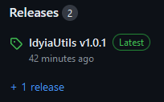
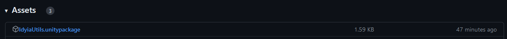
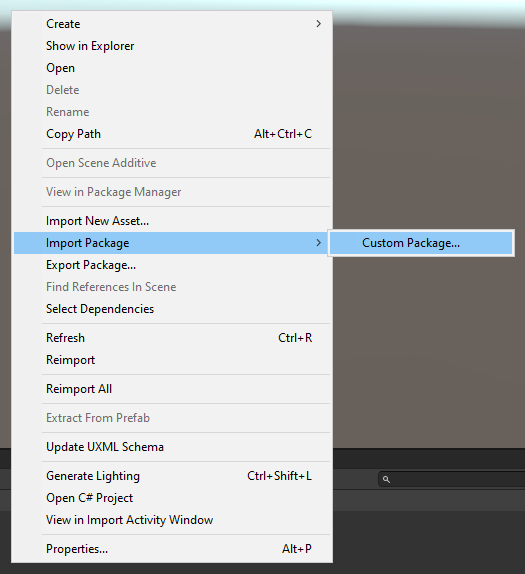

# IdyiaUtils
IdyiaUtils is a utility package for Unity that's designed to provide useful additional features and functionality through custom classes and extension methods.

## Download instructions
1) Navigate to the latest release on the right-hand-side of this page.
   

2) Download the top file named "IdyiaUtils.unitypackage".
   

3) Right-click empty space in the Assets mesnu of your Unity project and Import Package -> Custom Package. Then select the "IdyiaUtils.unitypackage" file you just downloaded.
   

4) That's it! You should now have access to IdyiaUtils. Read the documentation on [the wiki](https://github.com/Idyiax/IdyiaUtils/wiki) to learn what it can do and how to use it.
